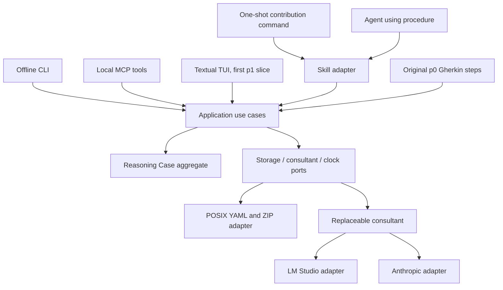

# Reason Commons architecture

How to work on this code (method, workflow, testing, recipes) is in
[docs/development](docs/development/README.md); this file records the boundaries.

The refined conversation fits Reason Commons directly: the app must preserve
reasoning correctly even if a skill is removed or a consultant misbehaves.
The first completed increment is **p0**, as selected by the existing delivery
manifest: all nine durable-case scenarios. V1 still ships after p2.

There is one bounded context, [Reasoning Case](src/reason_commons/domain/CONTEXT.md).
Storage and consulting are capabilities, not invented business contexts.
A context map with artificial edges would add ceremony without defining a real
boundary. Add another context and a published contract when independent domain
ownership actually emerges.

| Authority | Location | Responsibility |
|---|---|---|
| Product behavior | Existing `.feature` files and delivery manifest | What must be observable in each increment |
| Domain language and invariants | `domain/CONTEXT.md`, `domain/model.py` | Valid records, references, attribution and immutable history |
| Architecture/control | This file, `.workflow.json`, architecture tests | Inward dependencies, owned paths and required gates |
| Application contract | `application/ports.py`, `application/service.py` | Retention, consultation, retry, inspection, cursor and portability |
| Procedures | `skills/reason-commons-contribute/SKILL.md` | How an agent chooses and sequences capabilities |
| Adapters | `adapters/` | Storage, offline CLI and a replaceable procedure driver |
| Composition | `bootstrap.py` | Choose adapters, including the consultant provider; create/open/import a case |

The domain imports only the standard library. The application imports the domain
and defines outbound protocols; it never imports an adapter or skill. Interfaces
use application use cases. Filesystem code serializes validated records but does
not decide consulting meaning. `tests/test_architecture.py` checks inward imports.
The workflow manifest is review/control metadata; it is not an OS sandbox.

## Interface guarantees

**Semantic parity:** Any domain-significant operation offered by a local
interactive interface must be expressible through the skill capability surface.
Interface-only state such as focus, viewport, expansion and caret position is
exempt. Both surfaces use the same application use cases, validation, attribution,
exact targets and persistence outcomes. A particular skill may use a subset of
capabilities, but its host surface cannot omit an operation merely because a
human normally initiates it. Parity provides expressibility, not additional
authorization or an automatic action.

**Projection, not authority:** The TUI is a projection and interaction
accelerator over application state. It defines no reasoning invariants,
consulting semantics or persistence behavior unavailable through application
use cases. It may arrange views, retain editor state, expose shortcuts and show
receipts. An application use case must enforce the same rules when called by a
skill, a test or another interface; a TUI confirmation, menu restriction or
validation hint cannot be the sole enforcement of a consequential rule.

`CaseCapabilities` publishes all current semantic use cases, including source
attachment and portable export, plus their local reads. Cursor checkpointing
and session lifecycle are explicit exceptions. The architecture gate checks
coverage and argument parity against `CaseApplication`: a new public use case
cannot silently remain outside the skill surface. TUI actions call these use
cases; domain effects and local-versus-consultant routing are tested at that
boundary, while focus/layout behavior belongs in adapter tests. The first TUI
slice (`adapters/tui.py`) reads `workspace`/`inspect`/`history`/`sources` and writes only through
`retain_input`, `consult`, `retry`, the decision use cases (`accept`, `reject`, `undo`,
`still_holds`, `set_acceptance`), `export` and `checkpoint`; importing trees
goes through `add_source` and `submit` with a deterministic proposal adapter
(`adapters/ltp_trees.py`), the same path the `trees --import` command uses. The
confirmation the TUI shows before a decision that takes more than was chosen comes
from the use case itself, which refuses to act without `confirmed=True`. Its bindings are
covered by adapter tests, and 28 of the 32 p1 scenarios run through the real workspace as
interface acceptance steps (`tests/acceptance/steps/workspace_steps.py`); the gate lists the rest.

## Application surface

`create_case`, `open_case` and `import_case` return an application session that
is a context manager. Every use case accepts/returns plain serializable values.
Callers get copies of state, not mutable aggregate/repository handles.

- `inspect`, `workspace`, `history`, `sources`, `receipts`, `storage_help`: local reads.
- `checkpoint`: saves view, caret, draft and exact target without a revision.
- `retain_input`: saves literal text, declared speaker and exact target/base.
- `consult`: invokes an injected provider only for durably retained input.
- `submit`: combines retention and consultation for a deliberate submission.
- `retry`: uses the retained identity; an applied request never calls again.
- `accept`, `reject`, `undo`: the operator's decisions about proposals, each one local
  revision with no consultant call. Accept takes the waiting proposals the chosen ones
  need, reject the waiting proposals that need them, undo whatever cannot stand without
  the undone records. When that is more than was named (and for every undo) the result
  is `confirm`, listing everything, and nothing changes until the call is repeated with
  `confirmed=True`. A stale `base_revision` is refused.
- `still_holds`: closes a record's open review flags, recording the operator's judgment.
- `set_acceptance`: `review` (the default) or `automatic`, recorded as a decision. The
  MCP bridge refuses it unless the operator started the server with
  `--allow-acceptance-setting`; the contribution skill never calls it.
- `add_source`, `export`: local attachment and portable handoff operations.

The `CaseCapabilities` protocol is the shared semantic surface for skills and
local interfaces; it receives no repository capability. The contribution
procedure uses inspect, retain, consult and explicit retry, while other skills
can use the remaining capabilities. P0 has synchronous use
cases; p1 can invoke them in a worker while retaining UI focus. No event bus,
generic command dispatcher, service container or framework is necessary yet.

Result statuses distinguish `input_retained`, `saved`, `not_saved`, `unavailable`,
`rejected`, `stale` and, for decisions, `confirm`. Recovery actions are machine-readable control identities
for interfaces to act on, rather than a prose parser. `saved` means manifest
publication completed, not that an LLM said the work succeeded. A saved reply
reports what it `proposed` and what was `accepted_automatically`; a reply's updates
are proposals, and they enter the model only by a decision.

## Proposals and the model

The consultant drafts; the operator decides what enters the model. `Snapshot.apply`
publishes a reply's next question at once and appends its updates as records whose
membership is *proposed*. `Snapshot.decide` appends one decision (accept, reject,
undo, still holds, the acceptance setting) as a revision of its own. Snapshots carry
`membership` (where proposals begin, and the setting) and an append-only `decisions`
list; `domain/membership.py` derives everything else from them: what is in the model,
readiness, what a decision takes with it, the backlog's order and review flags. Flags
are derived from explicit references rather than stored. Under automatic acceptance
the ready proposals of a reply are accepted in the reply's own revision, recorded as
automatic with that request.

Only a newer consultant question makes a pending reply stale: decisions recorded while
the consultant works leave the response target unchanged, and the reply's proposals are
validated against the model as it then stands. Ancestry validation allows two kinds of
revision: one that applies exactly one request (and at most its own automatic
acceptance), and one that records exactly one explicit decision and nothing else.

Cases recorded before proposals needed acceptance have neither field. Every record in
them is in the model, and the first revision written under this contract sets
`proposals_from` to the number of records already there. `tests/fixtures/` holds such
a case, built by the previous release, and `tests/test_membership.py` opens it.

## Shared conversation projection

`application/presentation.py` derives a presentation-neutral workspace from one
captured published snapshot. `workspace` is a local application capability with
view, optional historical revision and exact selection. Its JSON contains the
question, goals, stored references, original forecasts and actual observations,
attribution, explicit unknowns and action routes. It makes no inference or write.
Next/explain show the intervention's explicit saved context (or records from its own input when no context is declared); full reasoning remains a separate local read. Historical views exclude later records/input and consultant moves. Tests preserve
original forecast bounds and separate work execution from expected attainment.

`adapters/rendering.py` renders that same value as terminal text, chat Markdown,
comparison tables and Mermaid. It draws only explicit record references, escapes
untrusted labels and supplies no causal or consensus semantics. The CLI `show`
and MCP `workspace` share these renderers. Contribution/retry entry points attach
the post-operation workspace to the authoritative result, independently of model
prose. The packaged skill uses the projection for a continuing conversation,
local explanation/inspection, ordinary replies and explicit consultant moves.
Replies remain bound to the last displayed live target; no silent retargeting.
The TUI reuses the projection and supplies its own layout and controls.

## Terminal workspace

`reason-commons tui <folder>` creates or resumes a case and opens a Textual app
(Textual is a core dependency). Consultant calls run in a worker thread so browsing
stays responsive; navigation never consults. Drafts, caret and view are saved
with `checkpoint`. `resume` refuses to create a case. Plain `reason-commons` first shows a goals home
screen over the case folders in `~/ReasonCommons`; it only lists (read-only
`inspect`) and creates (`create_case`) cases, then opens the chosen one. The consultant is chosen at
composition (`--provider`, `REASON_COMMONS_PROVIDER`, default `guided`) and can
be switched in the app by reopening the case with another adapter.

What a reply proposes is drawn under the next question, marked proposed, with an
**Accept all** button; the **Backlog** view lists waiting proposals and review flags
in decision order and decides them (Enter for choices, `a` accept, `r` reject, `h`
still holds); **History** undoes a step's acceptance with `u`; Commands switch the
acceptance setting and ask the consultant about open reviews. Each of these calls a
decision use case, and a decision that takes more than was chosen is shown in a
dialog from the use case's own `confirm` result before it is repeated with
`confirmed=True`.

`GuidedConsultant` is a deterministic implementation of the consultant port. It
asks the v1 loop's questions in order, proposes literal participant wording as
goal, test, action, observation and review records, and infers no measures,
ownership, evidence or outcomes. Its proposals go through the same validation
and wait for the operator as a model's do; it follows what is in the model or
still waiting, and a goal it proposes when the case has one is a new version of
it. When another consultant asked the last question, it continues from the
recorded state, keeping the answer as a note when it starts a new goal or test.

## Durability and recovery

The mutable manifest indexes hashes of complete YAML revisions. Each update
appends a candidate snapshot, fsyncs it and its directory, then atomically replaces
and fsyncs the manifest. Previous revisions are never replaced. `flock` holds one
editing session; a killed process releases it automatically. Read-only inspection
can coexist with a writer because published snapshots never change.

Inputs, supplied sources and attempt receipts are independently hashed,
append-only YAML records. Provider exceptions retain a category rather than
potentially secret exception text. Provider credentials are not stored.
The entire case and sources are explicitly supplied to the provider, with a `model`
summary (what is in the model, what waits, what was rejected or undone, and open
review flags); no hidden conversation is needed. The received proposal and provider version are retained
before validation/publication, so interrupted commits retry without another call.
The snapshot's applied-request ledger remains authoritative if receipt writing
fails after publication. Retry of an invalid proposal starts a fresh attempt;
retry of a stale input requires a new, explicit evaluation against the new base.

`allocations.yaml` durably reserves revision and object IDs before writing a
candidate. Crashes may leave gaps. Orphan candidates are never current history;
their reservations survive portable handoff so identifiers are never reused.
Failed retention keeps the literal input in session memory. Export to another
writable destination carries that text as an explicitly unretained draft.

Portable `.reasoncase` ZIPs contain published ancestry, reservations, inputs,
receipts, supplied sources and cursor. Import validates hashes, schema,
references, ancestry and member paths before creating an exclusively reserved
destination. It refuses existing destinations, duplicate entries, symlinks,
path traversal and oversized archives. Inspecting a bundle uses a temporary
read-only view and creates neither an editable case nor a writer lock.

The adapter targets local POSIX filesystems, tested on macOS. It does not provide
multi-host locking, Windows support or synchronized-folder merge semantics.
Hashes detect damage, not deliberate owner modification with recomputed hashes.
An fsync failure after rename can leave a visible but unconfirmed publication;
the operation reports `not_saved`. This is an operating-system durability limit,
not permission to show success before fsync. Idempotent recovery confirms the
published files and directories are flushed before it reports `saved`; continued
flush failures remain `not_saved` and never trigger another consultant call.

## Testing and increment boundary

`python3 scripts/check_p0.py` runs document consistency, the pre-existing checker
regressions, domain/storage/application/skill tests and, through Behave, **the
nine p0 scenarios**, every scenario of the two p2 features delivered so far (trees
in conversation, S128–S134, and deciding what enters the model, S135–S147), the
delivered p1 workspace scenarios and the conversation features. The runner locates
external step definitions; it does not copy, rewrite or weaken the feature files.
It also verifies the exact selected scenario identities and rejects undefined,
skipped or pending cases.
Fixture setup uses application use cases. Byte-level persistence checks inspect
archives returned by the public export capability.

Application acceptance uses a deterministic consultant fixture, with no LLM.
Separate skill tests record capability calls, ordering, forbidden access,
retention failures and resulting case state. The deterministic workflow driver
is a baseline; `LMStudioSkillAgent` also executes the actual procedure with a
real tool-calling model. Its bounded host exposes only capabilities authorized
for that invocation and records blocked requests as well as successful calls.
It cannot touch a repository or turn generated prose into a saved revision.
The live evaluator isolates procedure behavior with an authored downstream
consultant, then evaluates real semantic consulting and recovery separately.

`invocation.py` binds that same host to a real, selected case and consultant for
the `contribute`/`retry` commands. It reports application results independently
of model prose or agent-loop completion. The default procedure runner uses the
existing fixed-sequence driver. An explicitly selected agent runner executes the
Markdown procedure; it never silently falls back. The single skill source is a
packaged resource, linked from `skills/` and `.agents/skills/` so evaluations,
wheels and Codex use the same file.

`mcp_server.py` uses the optional official SDK for stdio transport, exposing the
published case capabilities to a client such as Codex. The bridge opens one
application session per call under a configured case root; it adds no persistence
or consulting rules. Domain validation, exact bases/targets and writer exclusion
remain in the existing layers. Its `context` read projects the owning artifacts,
rather than copying domain truth into the procedure. See [skill usage](docs/skill-use.md).

The consultant is a replaceable choice made only at composition. Two real HTTP
adapters implement the same `Consultant` port: `LMStudioConsultant` (local) and
`AnthropicConsultant` (hosted). Each uses the domain registry's JSON Schema
projection (shared in `provider_support.py`) and the packaged consulting
procedure/context, and translates the provider's structured output to a proposal
the application validates. `bootstrap.configured_consultant` picks one: an explicit
choice beats `REASON_COMMONS_PROVIDER`, which beats the local default. There is no
fallback between them, and an unknown name is rejected. `bootstrap.provider_settings`
reports the resolved choice and its readiness offline, without a request or a
secret value; the `providers` command projects it.

Model, endpoint and credentials stay outside case state; only each applied
request's consultant version is recorded, so a case can change consultants between
contributions. Malformed or truncated output has a distinct rejected-response
receipt. Transport and configuration failures keep the unavailable/retry
behavior, and the application records a safe failure category
(`configuration`, `http_error`, `timeout`, `connection` or `unknown`) with any
HTTP status. Provider exception text is never retained. The application holds no
provider-specific knowledge: an adapter only tags its exception.

The provider behavior participants see is specified in
`tests/conversation/features/providers.feature`, run through application use
cases with fixture consultants and loopback fake servers (`tests/servers.py`).
Protocol details, redirects, request limits and exit codes are adapter tests
(`tests/test_anthropic.py`, `tests/test_lm_studio.py`, `tests/test_providers.py`).
See [choosing a consultant](docs/providers.md), the [LM Studio guide](docs/lm-studio.md)
and its opt-in live smoke test.

The [validation harness](docs/validation.md) now retains repeated multi-turn
local-model proposals, capability traces, actual-server failures and attributed
review criteria. Machine success is separate from semantic approval. Prompt and
context resources are frozen/hashed for each consultant session. The provider
grammar distinguishes source identities, existing formulation refs and named
temporary updates; domain validation still decides publication.

P0 is complete. A first personal-use TUI slice ships, with the trees and the
backlog of proposals of p2; the remaining p1 contract, the rest of p2 (consulting
quality and the useful human review loop), complete semantic acceptance and
participant studies remain later work. The p2 envelope
name denotes the v1 **data profile**, not completion of p2 delivery behavior.
The conversational skill projects current saved record links; later typed graph/group semantics remain unavailable. No shell REPL is advertised. The
existing TUI design remains the p1 contract that the TUI slice works toward.

The offline legacy LTP continuation converter is a source-bound deterministic
proposal adapter. It uses existing public application operations, retains the
exact source and literal importing request, and proposes one imported baseline,
which waits for the operator's acceptance like any other proposal.
Unsupported structures are clearly labeled archival prose, rather than new
executable fields or invented domain types. Explicit legacy supersession does
not supply enough history to reconstruct original application revisions; future
contributions append snapshots through the ordinary boundary.
