# Reason Commons

**See a hard problem whole, as connected trees, then change it one honest test at a time.**


Reason Commons is a calm terminal workspace for reasoning about change: what you are
aiming for, what is really in the way, which conflict keeps you stuck and what to
try next. It lays that reasoning out as the six connected trees of the **Logical
Thinking Process** (from the Theory of Constraints), then turns the next action
into a small test: you write down what you expect **before** you act, and compare
it with what happened. Every statement keeps who said it and how it was worded,
and everything lives in a plain folder you own.

It suits any change where you are not sure what will work. A movement might want
to turn people who resonate with its ideas into people who practise them. A
community group might want more neighbours at the monthly meeting without burning
out the organisers.

## Quick start

On macOS or Linux, install [uv](https://docs.astral.sh/uv/) once, then open a new
terminal window:

```sh
curl -LsSf https://astral.sh/uv/install.sh | sh
```

Install Reason Commons and start it:

```sh
uv tool install git+https://github.com/life-itself/reason-commons-tui
reason-commons
```

There is no Python setup to manage. To update later, run `uv tool upgrade reason-commons`.

The first time, you choose how to begin:

- **Start my first goal**: the offline guide asks the questions, straight away.
- **Choose who asks the questions first**: your name, then the offline guide,
  Claude or a local model. About a minute.
- **Take the guided tour**: practise one whole loop with example answers. Nothing
  is kept.
- **Explore a real commons**: read how one movement's shared reasoning grew, step
  by step, and the action it says comes next.


After that, `reason-commons` opens a list of your goals. A goal opens on one
question; you answer in ordinary words. Enter adds a line, **Ctrl+S** sends,
**Ctrl+P** lists every command and **Ctrl+Q** quits. Everything is saved as you
type, including an unsent draft, and you come back to where you were.

## How it works

### Six questions, six trees

Every real change has to answer six questions. Each tree answers one, and each
connects to the next.

| Question | Tree |
| --- | --- |
| What must be true for us to reach the goal? | [Goal Tree](docs/the-trees.md#goal-tree-what-must-be-true) |
| Why are we not there yet? | [Current Reality Tree](docs/the-trees.md#current-reality-tree-why-are-we-not-there) |
| What conflict keeps us stuck? | [Evaporating Cloud](docs/the-trees.md#evaporating-cloud-what-keeps-us-stuck) |
| If we change this, will it work, and what could go wrong? | [Future Reality Tree](docs/the-trees.md#future-reality-tree-will-it-work) |
| What stands in the way, and what comes first? | [Prerequisite Tree](docs/the-trees.md#prerequisite-tree-what-comes-first) |
| What exactly do we do next? | [Transition Tree](docs/the-trees.md#transition-tree-what-exactly-do-we-do) |

The trees grow from the conversation. With Claude or a local model as consultant,
tell it what causes a problem, which conflict keeps you stuck, what stands in the
way or what you plan to do. It proposes each statement for its tree, in your words,
linked to the others, and you decide what goes in (see below). Ask it to reword or
drop something and it proposes that too; the earlier wording stays in the history.
Every arrow shows the assumption it rests on, so you can see where to push back.

Press **Ctrl+T** to open the trees. The first time, they open on **All six**: every
tree folded at what it is for, so you see the whole before going into one.
**Space** unfolds a branch and **Enter** opens its tree; the six are also listed under
**Trees** on the left, and **Ctrl+N** steps through them. Each line reads as a
sentence ("because: the group lacks a cadence"), with the statement's role after it
and the assumption behind the link underneath; a chain runs down one spine, so a
Prerequisite Tree reads as a ladder. A complete Evaporating Cloud is drawn as its
five boxes, both sides at equal weight. **↑** and **↓** choose a statement and show
the question worth asking of it, what it links to and where it came from. Trees you
already have come in from an `.ltp.yaml` file and go out the same way (**Ctrl+P**,
then **Import trees** or **Export trees**); what a file brings in waits for you like
any proposal.

Here is one tree from the real commons the app ships with: the **Second
Renaissance**, a movement that wants to help bring about a wiser, more
regenerative culture. Its Evaporating Cloud brings out the hidden assumption
behind a conflict that kept the group stuck.


<details>
<summary><b>See the other five trees for the Second Renaissance</b></summary>

**Goal Tree.** The vast goal breaks into three critical success factors and six
necessary conditions, so any small step can be checked against the whole.



**Current Reality Tree.** Many people resonate, yet few enter sustained practice.
Following the symptoms down leads to one likely constraint: there is no reliable
path from interest to practice.


**Future Reality Tree.** Before committing, check that the changes really lead to
the goal, and what they might break. Two risks show up, and each gets a trim.



**Prerequisite Tree.** Seven obstacles, each overcome by an intermediate
objective, in order. The first is to agree how the model itself gets checked.



**Transition Tree.** Concrete actions, each with what you expect to see when it
works. The first is one time-boxed review of the whole model.



</details>

[The six trees, explained](docs/the-trees.md) shows how to read each one, using
the Second Renaissance's
[tree-by-tree analysis](https://github.com/life-itself/reasoncommons/tree/main/ltp).

### You decide what enters your model

The consultant drafts what your words could mean; you decide what becomes part of
your reasoning. After each reply, **Next step** draws what it proposes beside the words
it came from, marked *proposed*. **Accept all** admits it; **Backlog** lists everything
waiting, in the order it is best decided: a new goal first, since everything else is
judged against it, then the trees in order, and whatever a proposal needs before it.
Accepting puts a statement in your model; it does not make it true.

When you accept a change to something, whatever cites it is flagged for review, with
the change that raised the flag, so a consequence reaches one step further each time.
Every acceptance can be undone from **History**, and an undo is final. If you trust the
consultant, **Ctrl+P**, **Accept proposals automatically** lets replies' proposals in as
they arrive, still marked and still undoable.


### From tree to test

Trees say what might work. The loop finds out: you take **one action**, write down
what you expect before it happens, do it, and review what happened against that
forecast.


The forecast can't be quietly rewritten afterwards, so at review it sits next to
the result. That is where the learning is. A test can name the tree action it
carries out, and its forecast and result then show under that action in the Trees
view.


After one loop you have a written goal and safeguards, a forecast, an honest
record of what happened and a decision you can explain.

## Who asks the questions

Reading, browsing, history, export and import never need a model. The questions
come from one of three consultants:

| | Built-in guide | Claude | Local model (LM Studio) |
| --- | --- | --- | --- |
| What it does | Asks the loop's questions in a fixed order; never gives advice | Adapts its questions, notices what is missing, gives advice on request and grows the trees | The same as Claude, on your own hardware |
| What you need | Nothing | An Anthropic API key | LM Studio with a chat model loaded |
| What it costs | Nothing | Paid per reply: about $0.004 with Claude Haiku 5.5 (the default), $0.05 with Sonnet 5.5 for one reply with deeper reasoning; the footer, each reply's notice and `reason-commons usage` estimate it, with a soft monthly budget if you want one | Nothing beyond your hardware |
| Does your goal leave your computer? | No | Yes: each consultation sends the goal's saved records to Anthropic | No |

The workspace starts with the built-in guide. Choose another under F2 **Settings**
on the home screen, then **You** (a Claude key is checked, and you pick from the models
it can use), or switch for a session with **Ctrl+P**. If a consultation fails, your words
are kept and a **Retry** button appears. `reason-commons providers` checks your
setup without sending anything.

More: [use Claude or a local model](docs/use-a-model.md) and
[choosing a consultant](docs/providers.md).

## Your reasoning is kept

- **One folder per goal.** Goals live in `~/ReasonCommons` (or `REASON_COMMONS_HOME`)
  as plain YAML. Settings and keys are kept elsewhere and never go into a goal.
- **A history you can step through.** **History** lists every saved step on one
  row: when, the question it answered or the decision taken, and what entered the
  model (and who, once more than one person has written). Open one to see the goal
  as it was then, and step with ← and →; **u** undoes a step's acceptance.
- **Move and share.** Export a goal as a portable `.reasoncase` file and import it
  elsewhere, with its whole history.

See [back up, share and move goals and trees](docs/back-up-and-share.md).

## Explore a real commons

**Explore a real commons** opens the Second Renaissance's shared reasoning,
read-only, on the one action it says comes next. Step back through each of the 24
saved steps of how it grew since June 2026: who said what, when, in their own
words, and what changed in the trees. The people quoted are still being asked for
their consent, so the story is marked as a draft.


## Beyond the workspace

- **From the terminal:** `reason-commons trees FOLDER` draws a goal's trees
  (`--tree current_reality` draws one), `show` reads any view offline, and
  `export` and `import` move goals. Run `reason-commons --help` for the full list.
- **From an AI agent:** an MCP server and a skill let an agent such as Codex hold
  the same conversation with the same rules. See
  [use Reason Commons from an AI agent](docs/skill-use.md).

## Status

This is an early prototype for personal use.

| | |
| --- | --- |
| **Works now** | The loop end to end, offline with the built-in guide or with an AI consultant; all six trees, grown in conversation by Claude or a local model, or imported; a backlog where you accept or reject what the consultant proposes, with review flags and undo; History for every goal; export and import; the real commons and the guided tour |
| **Planned** | Joint causes (AND), rival explanations; review of consequences no reference records; automatic acceptance above a confidence you set; group work, with several people's positions on one tree; an accessible plain-text mode |

The order follows the [delivery plan](reason-commons-spec/delivery-phases.md).

## Documentation

- [Tutorial: your first loop](docs/tutorial.md), step by step with pictures.
- [The six trees, explained](docs/the-trees.md) and [the loop, explained](docs/the-loop.md).
- [Workspace reference](docs/tui.md): keys, views, commands and settings.
- [All documentation](docs/README.md).
- Questions or ideas: [open an issue](https://github.com/life-itself/reason-commons-tui/issues).

## Contributing

Start with [contributing](CONTRIBUTING.md) and [how we develop](docs/development/README.md).
The [architecture](ARCHITECTURE.md) explains the domain, application and adapter
boundaries, and how BDD and replaceable skills use the same application surface.
The [p0 delivery report](docs/p0-delivery.md) records what is delivered, and the
[validation guide](docs/validation.md) runs live-model, real-agent and recovery
evaluations.

[MIT License](LICENSE)
