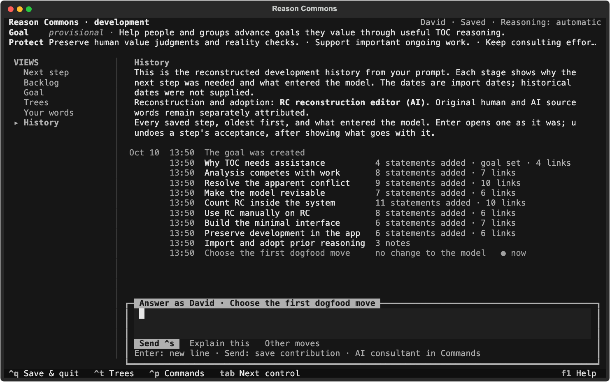

# Continue the reconstructed Reason Commons development

**Continue Reason Commons** creates this editable case once and then resumes it.
It opens after the reconstructed development has been imported and adopted.
The opening recommends a concrete reasoning action: trace why manual RC led to
this interface, what it was meant to change, and what would make that change fail.
Use that chain to identify the first improvement to RC itself.

## What the record contains

Ten stages explain the path from purpose to continued work:

1. Why TOC needs assistance.
2. Analysis competes with work.
3. Resolve the apparent conflict through assistance and Socratic questions.
4. Make the causal model revisable.
5. Count RC's own costs, opportunity cost and reasoning inventory.
6. Use RC manually to further RC; encounter tedious record keeping.
7. Build the minimal interface as the implemented injection.
8. Preserve the development argument, sources and adoption choices in the app.
9. Import and adopt prior reasoning.
10. Choose the first dogfood move.

**History** opens each stage with its narrative, reason for the next step and
what entered the model. Its native snapshots hold one goal, 59 claims across six
trees, 56 relationships and three notes: 119 adopted records in all. Cross-tree
links connect the implemented interface to the earlier consulting injection.
Empty Backlog means adopted reasoning; no proposals were rejected or dismissed.

Literal conversation turns, the builders brief, the hypothetical implementation
premise and the user's acceptance requirement are separately attributed sources.
Every interpretation also cites the reconstruction editor's actual stage input.
Your words shows readable source text; statement inspection shows source excerpts.
The human expert's name is not supplied in the dialogue, so David/Rufus authorship
is not invented. New contributions can use the person's declared name.

This is an **AI-authored reconstruction from the prompt**, not a recovered
engineering diary. The argument, manual use and already built effective TUI follow
the supplied scenario. Intermediate design implications and chronology are
reconstructed. Native dates and acceptance decisions belong to this import and
its editor, not imagined historical participants. No historical dates, manual
protocol, prospective trial forecast or measured outcomes are fabricated. No Git
history or other computer files were used to recover this account. Older ledger
and audit artifacts remain separate from the active import.



## Experiment with the imported state

From this checkout:

```sh
.venv/bin/reason-commons resume ~/ReasonCommons/reason-commons-development --speaker David --provider guided
```

Alternatively run `.venv/bin/reason-commons` and choose **Continue Reason Commons**.
The new folder preserves the older flat import as a separate case.

Start in **History**. Open **Use RC manually on RC**, then **Build the minimal
interface**, then compare the conflict and transition trees. Inspect a statement
to read its source words. Contribute a correction or development observation in
ordinary language; Ctrl+S saves it.

The demonstration starts with **Automatic** reasoning acceptance. In **F2 Settings**,
choose **Reasoning** and press Left/Right to select **Require acceptance**. A new
proposal then waits in **Backlog**; accept or reject it there. Switch back to
Automatic and the next proposal enters the model automatically. Previously waiting
proposals still need a decision. Each mode change and acceptance is in History.

The offline guide retains literal notes and the provisional next recommendation.
Select an AI consultant in Commands for adaptive questions and causal analysis.
The reconstruction and its checks use no live model calls; automated checks do
not establish participant usability or live consultant quality.

## Rebuild or inspect the review variant

Create an adopted portable handoff at a new output path:

```sh
.venv/bin/python scripts/build_commons.py --output /tmp/rc-working.reasoncase
```

Create the same argument waiting for acceptance:

```sh
.venv/bin/python scripts/build_commons.py --pending --output /tmp/rc-review.reasoncase
.venv/bin/reason-commons import /tmp/rc-review.reasoncase --store /tmp/rc-review-import
.venv/bin/reason-commons resume /tmp/rc-review-import --speaker David --provider guided
```

The review variant has 119 waiting proposals and no adopted tree statements.
**Adopt import** admits the argument using the ordinary acceptance capability.
Individual decisions remain available in Backlog. An adopted handoff in review
mode can also be built with `--acceptance review` without `--pending`.

The [default portable handoff](reason-commons.reasoncase) matches the new editable
case. Import refuses an existing destination; building an export also requires
an unused output path.

Actual TUI screenshots can be rendered with:

```sh
.venv/bin/python scripts/render_commons.py
```

Set `CHROMIUM` to a local Chrome/Chromium executable for PNGs as well as SVGs.

## Verification

The final `.venv/bin/python scripts/check_p0.py` gate passed: 476 pytest tests,
26 specification structural tests, all nine P0 cases, 12 tree cases, 16
proposal/review cases, 46 delivered P1 cases, 10 other delivered P2 cases and
all 28 conversational scenarios. Existing undelivered scope is unchanged.

Focused UI checks exercise both acceptance modes, adopting the pending import,
later contributions, stage titles, readable sources and 80×24 presentation.
Scratch mutations of stage naming, pending-import adoption and acceptance changes
were caught. The final review path also retains the useful next recommendation
after adoption instead of continuing to ask for an adoption already completed.

The handoff was imported into
`/Users/davidjoseph/ReasonCommons/reason-commons-development`. Read-only verification
confirmed that its native snapshot and sources match the archive, its revision is
10, and all 119 proposed records are adopted. Home resumes this same path without
reimporting. The review variant was built and imported into a disposable folder,
with 119 waiting proposals; an explicitly adopted review variant was also checked.
Actual History, stage detail, trees, settings and narrow-screen renders were
visually inspected. These checks do not constitute participant research or an
assessment of live consultant quality.
