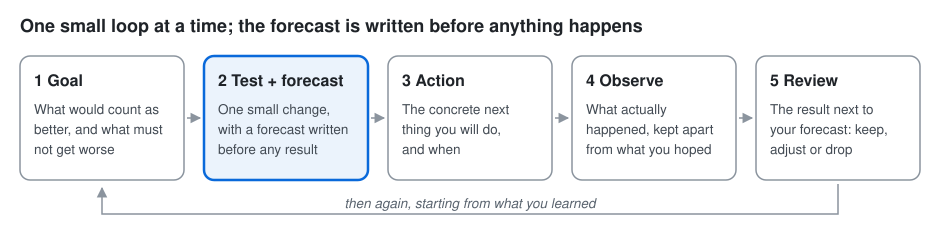

# The loop, explained

The six trees say what might work; the loop finds out. It is one small cycle:
**goal → test with a forecast → action → observation → review**, then again. In the
method's terms, each loop tests one action from a Transition Tree, the last of
[the six trees](the-trees.md), which the app draws in its Trees view (Ctrl+T).
This page explains why each step is there. To try it, follow the
[tutorial](tutorial.md).

## Why a loop, and why small

Important goals rarely yield to one big plan. What works is usually discovered by
trying something, looking honestly at what happened and adjusting. Small tests
are cheap, quick and reversible, so you can learn several times before a big plan
would have produced its first result.

## Why write the forecast first

After the fact, almost any result feels expected. Writing down what you think will
happen *before* the test runs, and keeping that original forecast unchanged, is
what lets you notice surprise. Surprise is where learning is: a result that beats
or misses your forecast tells you your picture of the situation needs updating.
That is why the review always puts your original words in front of you.

## Why safeguards

Progress on one thing can quietly cost another: a movement's reach at the expense
of trust, a team's speed at the expense of quality. Safeguards name what must not get
worse, and the review checks them first, so a gain bought with hidden damage is
caught early.

## Why observation is separate from action

Doing the planned thing is not the same as it working. The observation step asks
what actually happened, with numbers and a period if you have them, kept apart
from what you hoped. Your exact words are recorded, never rewritten.

## The built-in guide and AI consultants

The built-in guide asks the same questions in the same order and only proposes your
answers as the loop's records; it never interprets them or gives advice. An AI
consultant (Claude or a local model) adapts its questions and can advise when you
ask. Either way, the application checks every proposal before it is saved, nothing
it proposes enters your goal until you accept it (or choose automatic acceptance),
and your words stay yours.
See [use Claude or a local model](use-a-model.md).

## Words used in the workspace

| Word | Meaning |
| --- | --- |
| Goal | What would count as better, in your words, with a measure and date if you have them |
| Safeguard | Something that must not get worse while you pursue the goal |
| Test | One small, bounded change you can make yourself |
| Original forecast | What you expected before the test ran; saved and never changed |
| Action | The concrete next thing you will do, and when |
| Observation | What actually happened, as you report it |
| Review | The result next to the forecast and safeguards, ending in keep, adjust or drop |
| Tree | One of the six thinking-process trees; Ctrl+T shows them |
| Tree statement | One box in a tree, such as a root cause or an obstacle, in someone's own words |
| Consultant | Whoever asks the questions: the built-in guide, Claude or a local model |

## Where your data lives

Everything is saved as plain files in a folder per goal, by default under
`~/ReasonCommons`, as you type. Nothing is sent anywhere unless you choose an AI
consultant and press Send; see [back up, share and move goals](back-up-and-share.md).
