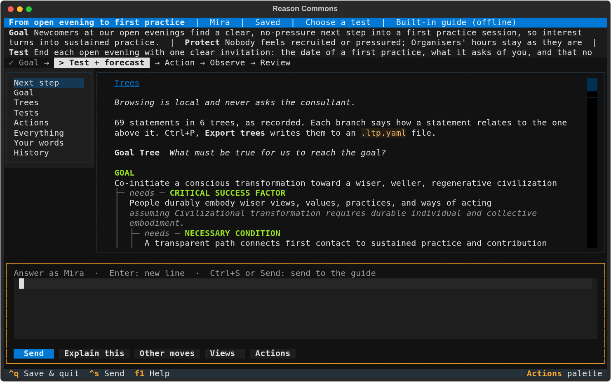

# The six trees, explained

Reason Commons is built on the **Logical Thinking Process** (LTP), the reasoning
method of the Theory of Constraints, developed by Eliyahu Goldratt and set out for
general problem-solving by H. William Dettmer. Its idea is simple: most stuck
situations have a small number of real constraints, and a modest change in the
right place moves the whole system. The trees are a disciplined way to find that
place, agree on it and act.

Each tree answers one question. The example throughout is the Second Renaissance
movement, analysed from its own documents in the
[Reason Commons guide](https://github.com/life-itself/reasoncommons/tree/main/ltp).
Labels in the pictures are shortened; the guide has the full wording, evidence and
open questions for every box.

> **In the app.** The app draws these six trees in its Trees view: press **Ctrl+T**.
> See [seeing the trees in the app](#seeing-the-trees-in-the-app) for how, and why
> it helps.

## Reading the pictures

Each box has a small label saying what kind of statement it is, such as a symptom,
a root cause or an action. The note in the top-right corner says what an arrow
means in that tree, because the meaning changes: in a Goal Tree an arrow says
"is necessary for", in a Current Reality Tree it says "causes". A red dashed line
is a conflict or a risk.

## Goal Tree: what must be true?

**Use it when** the goal is big or vague and people pull in different directions.

At the top is the goal. Under it are the few **critical success factors** that must
all hold, and under each, the **necessary conditions** that make it possible. Read
it bottom-up as "this is needed for that". It is a map of what matters, not a plan.

In the example, a civilisation-scale goal becomes six concrete conditions, such as
"a clear path from first contact to lasting practice". A small step can now be
checked against the whole: which condition does it serve?

**Check it by asking:** is each condition really necessary? Is anything missing,
such as resources, safety or legitimacy?

## Current Reality Tree: why are we not there?

**Use it when** the same problems keep coming back despite effort.

Start from the **symptoms** you can see today, the undesirable effects. Ask what
causes each one, and keep going until you reach **root causes**. Read it bottom-up
as "if this, then that". Often many symptoms trace back to one root cause: the
constraint.

In the example, a busy group with low lasting adoption, organiser overload and
fragile pockets all trace back to one likely constraint: no reliable path from
interest to practice. Every symptom is marked provisional, because the group has
not yet checked it against lived experience.

**Check it by asking:** does this symptom really exist? Is this cause enough on its
own, or does it need a partner? Could the arrow point the other way?

## Evaporating Cloud: what keeps us stuck?

**Use it when** two good people, or two good instincts, want opposite things.

A cloud has five boxes. On the right is the **shared objective**. In the middle are
two **needs**, both legitimate. On the left are the two **actions** each need seems
to demand, and they conflict. Read it right to left as "in order to ... we must
...". Every arrow rests on an assumption; the cloud "evaporates" when one of them
turns out to be false.

In the example, "act like a movement" and "act like a monastery" conflict. The
hidden assumption is that both draw on the same scarce organisers and cannot be
staged or combined. Questioning it opens a way out: a broad public invitation built
around deep, protected practice pockets, where reach feeds practice and practice
grows future facilitators.

**Check it by asking:** are both needs real? Which assumption under the conflict
arrow is weakest?

## Future Reality Tree: will it work?

**Use it when** you have a proposed change and want to test it before acting.

At the bottom are the **changes** you would make (in LTP, "injections"). Above them,
the **desired effects** they should lead to, all the way up to the goal. Read it
bottom-up as "if we do this, then that follows". Then look sideways for **negative
branches**: harm the change could cause.

In the example, seven changes lead step by step to lasting adoption. Two risks
appear: counting replaces real change, and people feel funnelled. Each gets a trim
before anything is built: mixed evidence and peer review; free choice and easy exit.

**Check it by asking:** does each effect really follow? What would a sceptic expect
to go wrong?

## Prerequisite Tree: what comes first?

**Use it when** the change is clear but the way there is not.

List the **obstacles** between today and the change. For each, name the
**intermediate objective** that overcomes it, then put the objectives in order.
Read it bottom-up: start at the bottom.

In the example, seven obstacles stand in the way of scaling through depth. The
first objective is a model the group has checked and accepts for provisional use,
because without it, nobody can fairly judge the later experiments.

**Check it by asking:** must this really come before that, or can some run side by
side?

## Transition Tree: what exactly do we do?

**Use it when** you are ready to act.

Each step pairs a concrete **action** with **what you expect to see** when it
works, and the objective it serves. Read it left to right.

In the example, the first action is one time-boxed, stewarded review of the goal,
the symptoms and the likely constraint. It is still the next action in the app's
**Explore a real commons**; the third, a clear next step from an open evening to a
first practice, is the test the [tutorial](tutorial.md) runs.

**Check it by asking:** how will we know it worked? Who does it, and by when?

## Seeing the trees in the app

The pictures above are drawn for this page. In the app, the **Trees** view draws
the same six trees as indented outlines, from what you and the consultant record as
you talk, or from an `.ltp.yaml` file you bring in. The real commons on the
home screen (**Explore a real commons**) carries this whole analysis and how it grew,
so it is the easiest place to start.

**Why open them while you work.** The trees keep the whole in view while you answer
one small question. Each branch shows the assumption it rests on, which is exactly
where a challenge belongs. Gaps stand out: an obstacle with no objective, or a
tree with nothing in it, is the next good question. And because every statement
keeps who said it and its earlier wordings, the reasoning builds up instead of
being lost in the conversation. Each tree's page counts what it does not say yet
(links that state no assumption, statements that state no basis), and where several
paths meet, the statement says how many of the tree's ends it leads to: the one root
cause behind most of the symptoms is the thing a Current Reality Tree is drawn to find.

**How.** Press **Ctrl+T** to open the trees. They open on **All six**: each tree
with its question, folded at what it is for, so you can see the whole method at a
glance. **Space** unfolds a branch; **Enter** opens the chosen statement's tree. The
six are listed under **Trees** on the left, and **Ctrl+N** steps through them. Each
tree's page asks its question and says which way to read it. Each line reads as a
sentence: the branch word ("needs:", "because:", "overcomes:", "produced by:") says
how a statement relates to the one above, its role follows in its colour, and the
assumption behind the link hangs underneath after a dotted rule. A chain runs down
one spine rather than stepping right, so a Prerequisite Tree reads as a ladder, and
a complete Evaporating Cloud is drawn as its five boxes. **↑** and **↓** choose a
statement, and the rest of the tree goes quiet around it, in place, so the statement
it serves and the ones beneath it stand out; its details give the question worth
asking of it, every link read from its side, the tests that carry it out, its earlier
wordings and who said it, in their own words. On a wide terminal they sit beside the
tree; **Enter** shows them full screen. **a** begins an answer about the chosen
statement, so "that one is not a root cause" says which one. After a reply that changed
the trees, the next question draws what was recorded beside the words it came from,
so you can catch a wrong reading while you still know what you meant, and the tree
marks those statements NEW or REWORDED. **Ctrl+T** again returns to the question. **Ctrl+P**, then **Import trees** or **Export trees**, moves trees in or
out as `.ltp.yaml`.

Joint causes (several causes that only work together), rival explanations and
boxed drawings of the other five trees arrive later, as the [delivery plan](../reason-commons-spec/delivery-phases.md)
describes. The [workspace reference](tui.md#the-trees) has the details.

## From the trees to the loop

The Transition Tree's "what we expect to see" is a forecast. That is the bridge to
what the app does today: each action becomes one loop, with the forecast written
before anything happens and the result reviewed against it. What you learn flows
back up: a surprising result is a reason to revisit an arrow in one of the trees.
See [the loop, explained](the-loop.md) and the [tutorial](tutorial.md).

## Read more

The [LTP guide](https://github.com/life-itself/reasoncommons/tree/main/ltp) has the
complete Second Renaissance analysis, including evidence, assumptions and the
recommended next action. The [specification](../reason-commons-spec/reason-commons-specification.md)
describes how each tree will work in the app.
