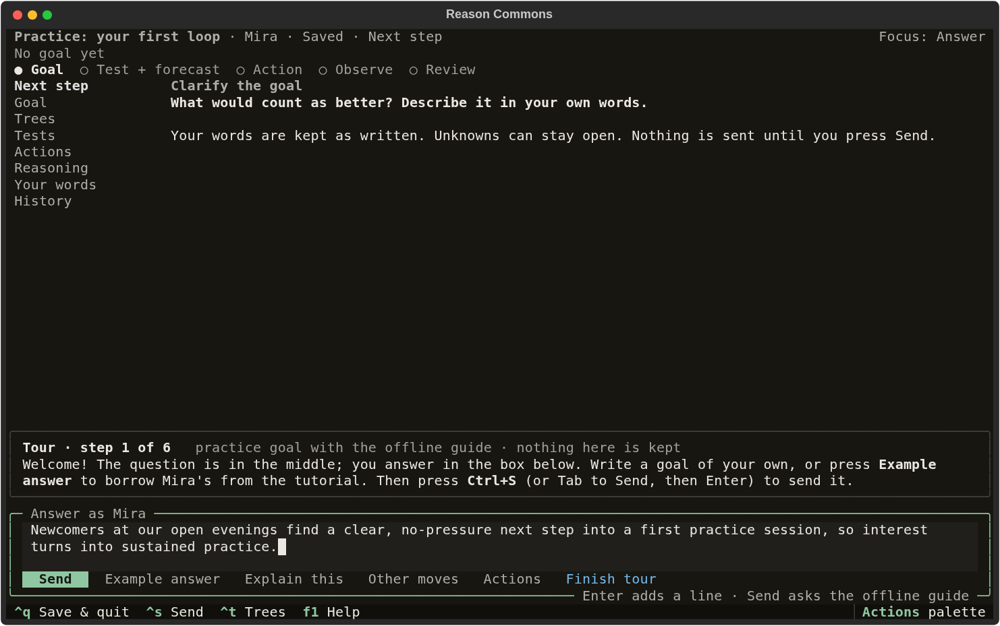
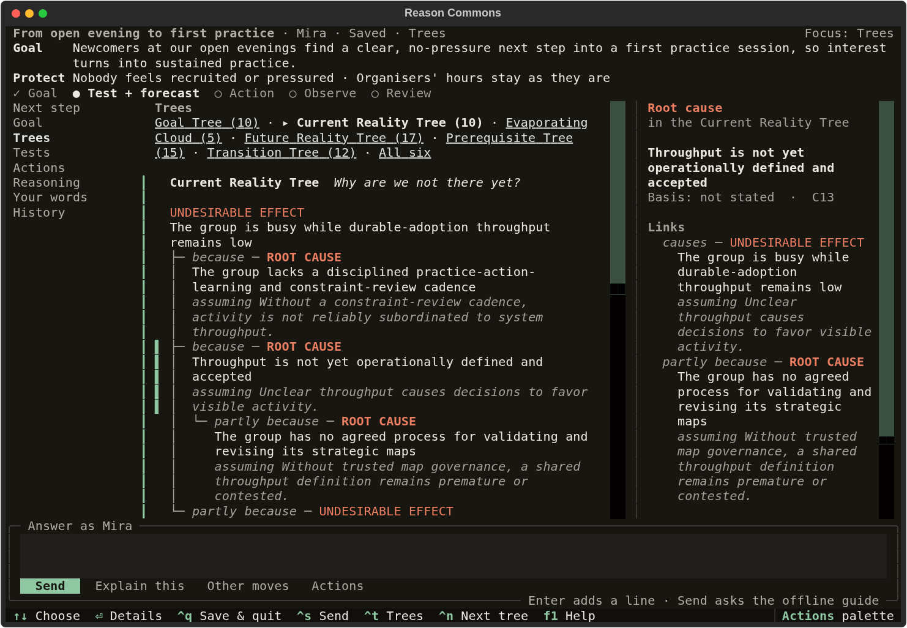

# Workspace reference

Facts to look up while you work. To learn the workspace step by step, follow the
[tutorial](tutorial.md); to install it, see the [README](../README.md#try-it).

## The screen

| Part | What it shows |
| --- | --- |
| Top line | The goal's name, your name, whether everything is saved (or *Asking …* while the consultant works, *Answer ready* when its reply waits on **Next step**), the view, and on the right which control has the keyboard |
| Pinned lines | Your goal and safeguards, and the open **Action**; a long goal ends in … and **Goal** shows all of it. At review the safeguards move down, next to the result |
| Loop line | Goal, Test + forecast, Action, Observe, Review: ✓ finished, ● current, ○ still to come |
| Middle | The current question and what it builds on (at review: the original forecast beside the result), or the view you chose |
| Views list | On terminals 100 columns or wider; narrower, the **Views** button takes its place |
| Answer box | Your answer; all typing is literal, including `?`, `q` and numbers. Its frame says who you answer as and who **Send** asks, and turns bright while you type. It grows as you write |

On a small terminal (80×24) the views list gives way to the **Views** button, and
the forecast and the result stack one above the other:

## Keys and controls

| Key or control | What it does |
| --- | --- |
| Enter | New line in your answer |
| Ctrl+S, or Tab to **Send** then Enter | Send your answer |
| Tab / Shift+Tab | Move between controls |
| Esc | Leave the answer box to browse; your text stays |
| Ctrl+T | Open the trees, with the keys on the drawing; press again to go back to the question and your draft |
| ← / → | Step back or forward through saved steps, when the answer box is not in use |
| Ctrl+N | In the Trees view: the next tree, one at a time, then all six together |
| ↑ / ↓ | In the Trees view: choose a statement |
| Enter | In the Trees view: the chosen statement's details in full; Esc returns |
| **Explain this** | Why the current question matters (saved, no consultant call) |
| **Other moves** | Local explanations, or ask the consultant for advice or a different question |
| **Views** | Switch view, when the list on the left does not fit |
| Ctrl+P (**Actions**) | Export, import or export trees, retry, change consultant, views, help, quit |
| F1 | Help |
| Ctrl+Q | Save your draft and quit |

On the goals list: arrows choose, Enter opens, F1 shows help, Ctrl+Q quits.

## First start, settings and the tour

The first time, `reason-commons` offers four ways to start: start a first goal
straight away (the offline guide, with your login name), choose who asks the
questions first, take the guided tour, or explore a real commons. Choosing
first asks for your name (recorded with your answers), the consultant and, for
Claude or LM Studio, checks the connection and lets you choose a model. Esc goes
back a step; leaving setup changes nothing. **Settings** on the home screen runs
it again.

The guided tour opens a practice goal with the built-in guide. A coaching strip
explains each of the six steps; **Example answer** puts the tutorial's answer in
the box and **Finish tour** returns to the home screen. The practice goal is
deleted afterwards.

## Screens

A picture of each part of the workspace, drawn from Mira's example goal, a goal in
progress or the real commons. `scripts/render_screenshots.py` regenerates them.

### First start

| | |
| --- | --- |
|  | The ways to start, shown once |
|  | Setup: who asks the questions |
|  | Setup: the models your key can use |
|  | The guided tour's coaching strip and **Example answer** |

### The goals list

| | |
| --- | --- |
|  | Goals, **Start a new goal**, the real commons, the tour and **Settings** |
|  | Naming a new goal |
|  | F1: how the loop works |

### The workspace

On a narrow terminal the views list is hidden; **Views** opens it.

**Explain this** shows why the question matters, saved and without a consultant call.

**Other moves** offers local explanations, or asks the consultant for advice, a different question or help planning an observation.

If the consultant cannot be reached, your words are kept and **Retry** appears.

F1 shows help.

### Views

| View | Screenshot |
| --- | --- |
| Goal |  |
| Tests |  |
| Actions |  |
| Reasoning |  |
| Your words |  |
| History |  |

### Looking back and the real commons

Enter on a History step opens that moment, read-only: the question it answered, the
words, what changed and what was asked next. ← and → step through.

**Explore a real commons** opens on the decision the Second Renaissance story waits
on and its one open action; each step back shows the editor's narration, the quoted
words, the source and what changed.

| | |
| --- | --- |
|  | Now |
|  | One step back |

### The trees

Before anything is recorded the Trees view says how they grow.

Ctrl+N steps through the trees:

| Tree | Screenshot |
| --- | --- |
| Goal |  |
| Current Reality |  |
| Evaporating Cloud |  |
| Future Reality |  |
| Prerequisite |  |
| Transition |  |
| All six |  |

↑ and ↓ choose a statement; on a wide terminal its details sit beside the trees,
and Enter shows them full screen at any size.

| Size | Screenshot |
| --- | --- |
| 120 by 40 |  |
| 80 by 24, after Enter |  |

### Actions (Ctrl+P)

Type to filter the list.

| Action | Screenshot |
| --- | --- |
| Export case |  |
| Export trees |  |
| Import trees |  |

## Views

Browsing views never calls the consultant.

| View | Shows |
| --- | --- |
| Next step | The current question and what it builds on |
| Goal | Goal, measure and safeguards |
| Trees | The six thinking-process trees, drawn from what was recorded; each branch says how a statement relates to the one above it. Choose a statement for its links, wording and origin |
| Tests | Each test with its original forecast next to the reported result, and reviews |
| Actions | Planned actions |
| Reasoning | All saved records, and what is still open |
| Your words | Your answers, exactly as written |
| History | Every saved step, oldest first: when, who, and what changed; Enter opens that moment |

With the built-in guide, an empty answer skips an optional question (measure,
safeguards, review date, stop condition).

## Looking back

Every goal keeps each saved step. **History** lists them oldest first, with the
date, who answered, the question they answered and what changed (statements added,
reworded or withdrawn, links, tests). Tab to the list; Enter opens that moment: the
goal exactly as it was, the question, the words that answered it, what changed, and
what was asked next. The Trees view then marks that step's statements NEW or REWORDED.
**← / →** (or **◀ Earlier**, **Later ▶**, shown in the footer while you look back)
step through; **Back to now** returns. The top line says *Read-only*; nothing can be
changed while looking back, and your unsent draft waits.

An **Action** line under the goal shows the open action (planned, its test not yet
observed) and its owner, except where the screen already shows that action.

**Explore a real commons** on the home screen opens the Second Renaissance's shared
reasoning this way, read-only. It leads with the decision the story is waiting on,
then the action's owner, what it carries out, what to expect and when to stop. Each
step back shows the editor's narration in italics above the quoted words; the words
are real and dated, the tree changes are an editor's reading, and approximate dates
are marked ≈. **Start my own goal** and **Back to start** leave it; nothing there is
kept.

## The trees

Ctrl+T opens the Trees view and shows one tree at a time: Goal, Current Reality,
Evaporating Cloud, Future Reality, Prerequisite or Transition. Ctrl+N moves to the
next one, and after the Transition Tree shows all six together; the line at the top
says which tree is on screen and how many statements each holds. The app remembers
the tree you last looked at; the tree names are also links you can click. Each statement shows its
role (for example ROOT CAUSE or OBSTACLE) and, where recorded, whether it is a
hypothesis or a report. Branches read top down: "needs", "because", "overcomes",
"produced by", each with the assumption behind it. A statement reached twice is
drawn once and then referred to.

Ctrl+T puts the keys on the drawing, with a statement chosen; a bar in the margin
marks it. ↑ and ↓ choose another. Its details read every link from its side
("causes", "because", "required by"), with the assumption behind each, then the
tests that carry it out, its earlier wordings, and where it came from: who wrote
the words it cites, when, and the words themselves, or the file it was imported
from. At 120 columns or wider they sit beside the trees and follow your choice;
Enter shows them full screen at any size, and Esc returns to the same statement.
Ctrl+T again takes you back to the question, with your draft as you left it. The
app remembers the statement you chose. Choosing and reading never call the
consultant.

After a reply that changed the trees, the question says so ("In the trees, the
last step: Current Reality Tree: 2 statements added · 1 link"), the tree names
mark which trees changed, and the drawing marks those statements NEW or
REWORDED.

Claude and LM Studio add to the trees when you tell them about causes, conflicts,
obstacles or plans, and reword or drop a statement when you ask. The built-in
guide does not add to them. Under Actions (Ctrl+P), **Import trees** brings in an
`.ltp.yaml` file and **Export trees** writes one; imported trees join the ones
already there, and anything the trees cannot draw (a joint cause, an assessment)
is kept as a note.

## Commands

| Command | What it does |
| --- | --- |
| `reason-commons` | The first time, the ways to start; then your goals: open one, start one, the tour, the real commons or Settings |
| `reason-commons tui FOLDER` | Open a goal in that folder, creating it if needed |
| `reason-commons resume FOLDER` | Open an existing goal; never creates one |
| `reason-commons export FOLDER FILE` | Write a portable `.reasoncase` copy |
| `reason-commons import FILE --store FOLDER` | Continue from a copy in a new folder |
| `reason-commons show FOLDER_OR_FILE` | Print a goal without opening the workspace |
| `reason-commons trees FOLDER` | Draw the goal's trees; `--import FILE` brings trees in from an `.ltp.yaml` file, `--export FILE` writes them out; `--tree current_reality` draws just one |
| `reason-commons --version` | Show the version |

`tui` and `resume` also take `--speaker NAME` (the name recorded with your
answers; default: your login name), `--provider guided|anthropic|lm-studio`,
`--model` and `--base-url`. `tui` takes `--name` for a new goal's name. Every
way of opening the workspace takes `--theme` (see [Themes](#themes)). Commands
for scripts and AI agents are listed by `reason-commons --help`.

## Settings

Setup saves your name, consultant, model, Claude key and LM Studio address in
`~/.config/reason-commons/settings.yaml` (or `$XDG_CONFIG_HOME/reason-commons/`;
`REASON_COMMONS_CONFIG` names another file), readable only by you. Command-line
options win over environment variables, which win over that file. To set them in
your shell instead, for example in `~/.zshrc` on a Mac:

| Variable | Effect | Default |
| --- | --- | --- |
| `REASON_COMMONS_HOME` | Folder that holds your goals | `~/ReasonCommons` |
| `REASON_COMMONS_CONFIG` | Personal settings file written by setup | `~/.config/reason-commons/settings.yaml` |
| `REASON_COMMONS_PROVIDER` | Consultant at start: `guided`, `anthropic` or `lm-studio` | `guided` |
| `REASON_COMMONS_SPEAKER` | Name recorded with your answers | the name from setup, else your login name |
| `ANTHROPIC_API_KEY` | Key for Claude | none |
| `REASON_COMMONS_ANTHROPIC_MODEL` | Claude model ID | `claude-sonnet-5-5` |
| `REASON_COMMONS_LM_STUDIO_URL` | LM Studio server address | `http://127.0.0.1:1234/v1` |
| `REASON_COMMONS_LM_STUDIO_MODEL` | LM Studio model ID | the only loaded model |
| `LM_STUDIO_API_TOKEN` | LM Studio token, if your server needs one | none |
| `REASON_COMMONS_THEME` | Colour theme (see [Themes](#themes)) | `commons-dark` |

Keys and server addresses are never written into your goals or exports.

## Themes

The workspace speaks in the same twelve voices as the Reason Commons web app, each
in a light form (the web palette) and a dark form (the same hues for a dark
terminal). Choose one in the app, and it is kept:

- **In the app:** Ctrl+P, **Theme**, or **Theme** on the goals list. Moving through
  the list previews each voice; Left and Right switch between light and dark; Enter
  keeps it and Esc puts back the one you had.
- **In your settings file:** `theme: tanizaki-dark`. The app writes this line when
  you choose in the app.
- **For one run:** `reason-commons --theme "Shadows dark"`, or
  `REASON_COMMONS_THEME=goethe` in your shell, which wins over the settings file.

A theme is named by its id or its label, in any case, with `dark` or `light`
after it if you like:

| Id | Label | Reads its colours from |
| --- | --- | --- |
| `commons` | Commons | the public voice, and the default |
| `organic` | Organic | cream and earth |
| `schopenhauer` | Schopenhauer | graphite ink and one judgment colour |
| `goethe` | Goethe | the polarity of yellow and blue |
| `steiner` | Steiner | image and lustre |
| `al-haytham` | Optics | Ibn al-Haytham: the instrument plane |
| `tanizaki` | Shadows | Jun'ichirō Tanizaki: smoked parchment, no white anywhere |
| `suhrawardi` | Illumination | Suhrawardi: presence through degrees of light |
| `wittgenstein` | Grammar | Ludwig Wittgenstein: four hues that exclude one another |
| `yoruba` | Chromatics | Yorùbá chromatics; the mapping is ours, not the tradition's |
| `wuxing` | Five Phases | Wǔsè / Wǔxíng; the four assignments are ours |
| `khipu` | Channels | Inka khipu; the theme that leans least on hue |

Every theme keeps the web app's four colour families apart: the **hand** (yours to
act on: Send, focus, the frame around what you are editing), **proposed** (not yet
in the record), **stood behind** (relied upon) and **disagreed** (reality pushed
back, or something going wrong). In the Trees view, what you want is drawn in
stood behind, what is wrong in disagreed, what you do in the hand and what you
think you must do in proposed. Every coloured word clears WCAG AA contrast on its
background. Fonts are your terminal's; rounded frames stand in for the web's soft
corners, and square frames for its hard-edged voices.

## The goal folder

Each goal is a folder of plain YAML files, saved as you type: revisions, your
inputs, consultant attempts and the workspace position (view and unsent draft). A
lock file lets only one workspace edit a goal at a time. Treat the folder as a
whole; use export and import rather than editing files by hand.

## Not in this version yet

An accessible plain-text mode (`--accessible`), switching between several people
in one goal, attaching sources from the workspace, and the trees' richer reasoning
checks (joint causes, rival explanations, boxed diagrams). They
are specified in [TUI-DESIGN.md](../TUI-DESIGN.md).
