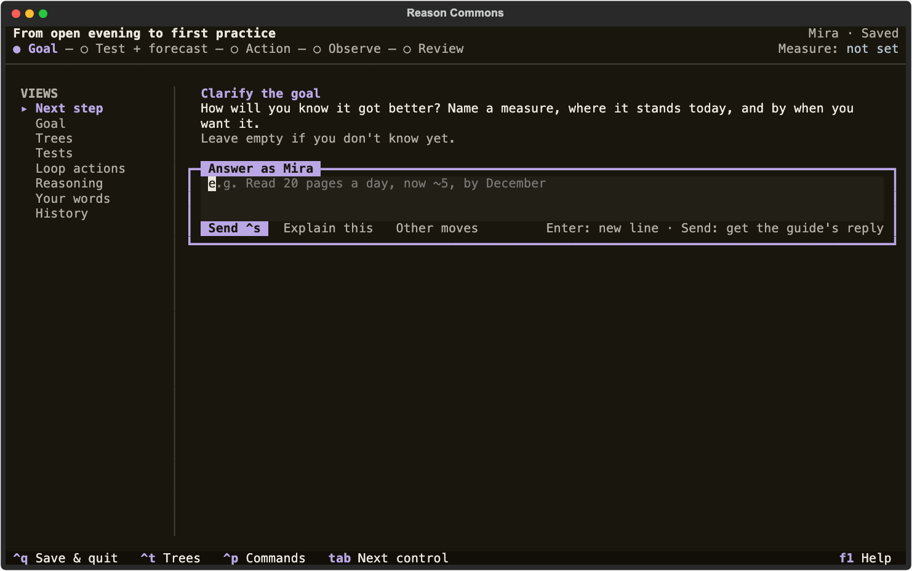
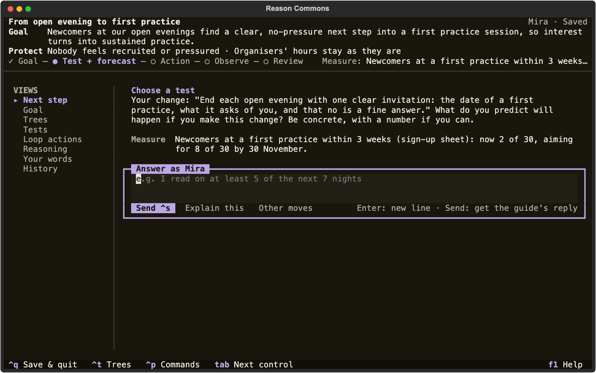
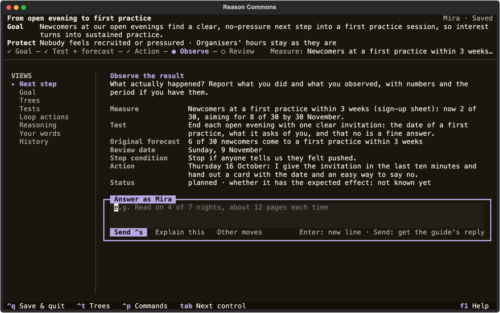
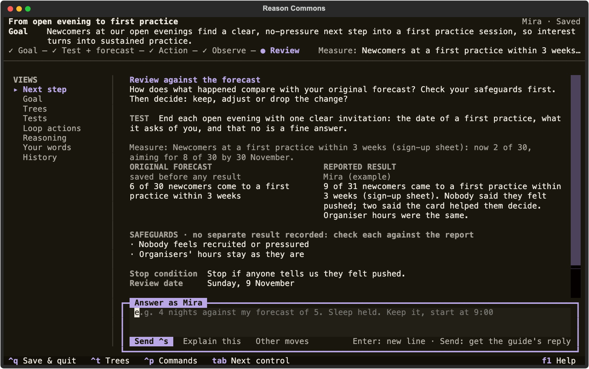

# Tutorial: your first loop

In this tutorial you take one small goal through a whole loop: goal, test with a
forecast, action, observation and review. At the end you see where the test sits in
the six trees. The typing takes a few minutes; the
test itself runs in your real life for as long as you choose. You need nothing but
Reason Commons itself ([install it](../README.md#try-it)); the built-in guide works
offline.

Prefer to learn inside the app? Choose **Take the guided tour** on the first
screen or the home screen. It is this tutorial as a practice goal: a coaching
strip explains each step, **Example answer** fills in Mira's words, and nothing is
kept.

We follow Mira, who organises open evenings for a Second Renaissance group. Many
people come once and are inspired, but few find their way into regular practice.
Mira takes one action from the group's [Transition Tree](the-trees.md#transition-tree-what-exactly-do-we-do)
and tests it: a clear next step from an open evening to a first practice. Use your
own goal if you have one, or copy Mira's answers to get a feel for it first.

## 1. Start a goal

Run `reason-commons`, choose **Start my first goal** (later, **New goal**)
and give it a short name, such as "From open evening to first practice". The
workspace opens with one question: what would count as better?

Type in the box right under the question. **Enter** starts a new line; **Ctrl+S** sends. Mira
writes:

> Newcomers at our open evenings find a clear, no-pressure next step into a first
> practice session, so interest turns into sustained practice.

Ordinary words are enough. You can correct anything later.

## 2. Say how you will notice, and what must not get worse

The guide asks how you will know it got better. A measure, today's level and a
date make progress visible. Leave it empty if you don't know yet.

Mira answers with a measure and a target, and then, to the next question, two
safeguards: things that must not suffer while chasing the goal. The group's
Future Reality Tree warned that a pushy entry path would cost trust, so that
becomes the first safeguard.

> Newcomers at a first practice within 3 weeks (sign-up sheet): now 2 of 30,
> aiming for 8 of 30 by 30 November.

> Nobody feels recruited or pressured
> Organisers' hours stay as they are

Notice the line under the pinned goal: it marks where you are in the loop.

## 3. Choose one small test and forecast it

Next comes one change you can make yourself. Keep it small enough to try soon.
Mira picks:

> End each open evening with one clear invitation: the date of a first practice,
> what it asks of you, and that no is a fine answer.

Then the most important question: **what do you expect to happen?** The guide
repeats the change you just wrote, so you forecast exactly that. Write it down now,
with a number if you can. This original forecast is saved before any result
exists, and it never changes.

> 6 of 30 newcomers come to a first practice within 3 weeks

The guide also asks when you will look at the result and what would make you stop
early. Both are optional; Mira answers "Sunday, 9 November" and "Stop if anyone
tells us they felt pushed."

## 4. Plan the action

Name the very next thing you will do, and when:

> Thursday 16 October: I give the invitation in the last ten minutes and hand out a
> card with the date and an easy way to say no.

Now quit with **Ctrl+Q** and carry it out. Everything is saved, including any
half-written answer.

## 5. Report what actually happened

When the review date comes, run `reason-commons` and pick the goal. The guide asks
what actually happened. Report what you observed, separately from what you hoped.

> 9 of 31 newcomers came to a first practice within 3 weeks (sign-up sheet).
> Nobody said they felt pushed; two said the card helped them decide. Organiser
> hours were the same.

## 6. Review against your forecast

The review question puts your original forecast, in its exact words, next to what
you reported, with your safeguards underneath. Check the safeguards first, then
decide: keep, adjust or drop the change.

> Keep it. I forecast 6 of 30 and got 9 of 31, and both safeguards held.
> Next I will test whether people come back for a second session.

**Tests** (in the list on the left, or **Views**) keeps every test with its
forecast and result side by side:

## 7. See a real commons, and where a test like Mira's sits

Mira is invented; the analysis her action comes from is not. On the home screen,
choose **Explore a real commons**. It opens the Second Renaissance's shared
reasoning as it stands now, read-only, with the one action it says comes next: a
time-boxed, stewarded review of the trees.

Press **←** (or **◀ Earlier**) to step back through how it got here, one saved step
at a time: David's first goal tree on the forum, Robert's objections, the move to
decide how the trees get updated before defining throughput, and so on. Each step
shows who said it, when, their exact words and what changed in the trees.
**History** lists every step; Enter opens one.

Press **Ctrl+T**: the Trees view opens on **All six**, each tree with its question and
folded at what it is for, and the Views list names the six trees under **Trees**.
Choose **Transition** there, or press **Ctrl+N** until the Transition Tree is on
screen. **↓** chooses a statement and shows the question worth asking of it, what it
links to and whose words it came from. Its third action, a next step from a public contact into a first practice,
is the kind of test Mira ran. This is the moment to look: the trees show which
actions nobody has tested yet, and which cause or assumption a surprising result
calls into question. That is where the next loop comes from.

**Start my own goal** takes you from there to a new goal of your own.

Your own goal starts with empty trees. With Claude or a local model as your
consultant, tell it what causes a problem, which conflict keeps you stuck, what
stands in the way or what you plan to do, and it adds each statement to its tree
in your words ([how](use-a-model.md#grow-the-trees-as-you-talk)). The built-in
guide does not add to the trees, but you can
[bring in trees you already have](back-up-and-share.md#bring-trees-in-or-out).
Press **Ctrl+T** again to go back to the question.

## What you have now

A goal with a measure and safeguards, a test whose forecast you could not quietly
rewrite, an honest observation and a decision you can explain. The guide now asks
for the next small change, so the next loop starts from what you learned. For
Mira's group, the result is also evidence for the trees: it supports the Current
Reality Tree's guess that the missing next step was a real cause.

Next: read [the loop, explained](the-loop.md) to see why each step is there, or
[use Claude](use-a-model.md) for a consultant that adapts its questions and can
give advice.
